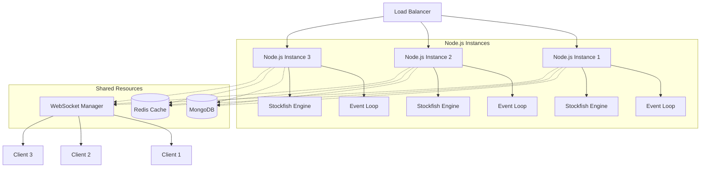
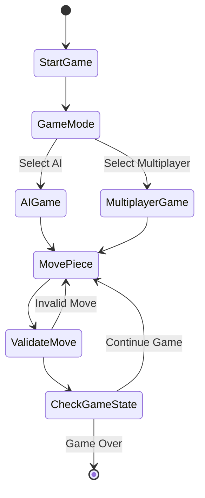
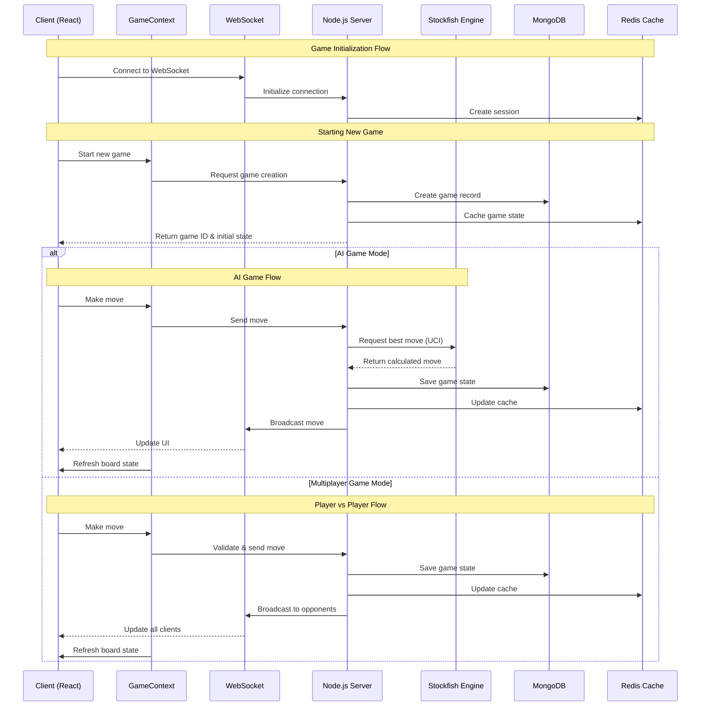

# Web-Based International Chess System

A modern web-based chess platform built with React, Node.js, and Stockfish integration.

## System Architecture

### Backend Architecture

### Game Flow

### Component Interaction

## Component Interaction Details

The component interaction in our International Chess system represents a sophisticated interplay between various layers and services. When a user starts a chess match, the React frontend establishes a WebSocket connection with the Node.js server, enabling real-time bidirectional communication. The GameContext, implemented using React's Context API, serves as a central state management solution, handling chess-specific state like piece positions, captured pieces, move history, and game status (check, checkmate, or stalemate).

### Communication Flow
The communication flow begins when a player makes a move on the chessboard. The move is first processed by the GameContext, which manages the local game state and validates basic chess rules including piece movement patterns, castling conditions, en passant opportunities, and pawn promotion scenarios. The validated move is then transmitted through the WebSocket connection to the Node.js server. The server acts as the authoritative source of truth, performing deep validation of chess rules and maintaining game consistency.

### AI Integration
In AI game mode, the server interfaces with the Stockfish chess engine through the UCI (Universal Chess Interface) protocol. When a player makes a move, the server translates the game state into FEN (Forsyth–Edwards Notation) notation, which is sent to Stockfish. The engine, renowned for its strong chess play, calculates the optimal response based on configured difficulty levels and returns it to the server, which then broadcasts the move to the client through WebSocket channels. Stockfish's evaluation of positions and suggested lines of play can also be transmitted to provide analysis features for players.

### Multiplayer Handling
For multiplayer games, the server manages concurrent chess matches and player interactions. When a move is made, it's first validated against standard chess rules, then persisted in MongoDB for long-term storage and cached in Redis for quick access. The updated game state, including the board position, captured pieces, and time controls, is broadcast to both players in real-time through WebSocket connections, ensuring perfect synchronization of the game state.

### Data Management
Data persistence is handled through a dual-layer approach:
- **Redis**: Provides high-speed caching for active chess matches, storing ephemeral data like current positions, time controls, and player sessions
- **MongoDB**: Serves as the permanent data store for completed games, user profiles, ELO ratings, and match statistics

### Error Handling
Error handling is implemented across all layers of the system. The frontend components gracefully handle connection issues and illegal moves, while the server manages game state conflicts and engine communication errors. WebSocket connections are monitored for disconnections, with automatic reconnection attempts and game state recovery mechanisms in place to ensure a smooth user experience, particularly crucial during timed matches.

### Scalability
The entire system is designed to be scalable, with the Node.js server instances running behind a load balancer. Each server instance maintains its own Stockfish engine processes and WebSocket connections, while sharing game state through the Redis cache. This architecture allows for horizontal scaling to handle increasing numbers of concurrent chess games while maintaining consistent performance and real-time responsiveness.

## Technology Stack

### Frontend
- React + TypeScript
- Material UI components
- WebSocket for real-time updates
- Context API for state management

### Backend
- Node.js + Express
- MongoDB for data persistence
- Redis for caching
- Socket.IO for WebSocket communication
- Stockfish chess engine

### DevOps
- Docker for containerization
- Load balancer for horizontal scaling
- Automated testing with Jest
- Git for version control
